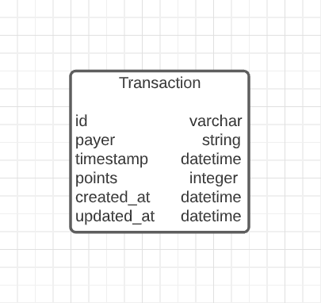

# Points App

## Setup

To download the dependencies for this web service, run:

```sh
bundle install
```

There is some starter code in the `db/seeds.rb` file so that once you've
generated the models, you'll be able to create data to test the application.

You can run your Rails API on [`localhost:3000`](http://localhost:3000) by running:

```sh
rails s
```

You can test and check the application by running the Rails server and using Postman to make requests.

## Models

This app contains the following model:

- A `Transaction`

The the model and migrations are based on the following database table:



Then, run the migrations and seed file:

```sh
rails db:migrate db:seed
```

> If you are not able to get the provided seed file working, you are welcome to
> generate your own seed data to test the application.

## Validations

There are three validations to the `Transaction` model:

- must have a `payer` that is not nil
- must have `points` that is not nil
- must have `timestamp` that is not nil

## Routes

The application contains the following specified routes along with the appropriate HTTP verb.

### GET /balance

For all existing recent `Transaction`s created, return JSON data in the format below without repeating payers:

```json
[
  {
    "DANNON": 1000,
    "UNILEVER": 0,
    "MILLER COORS": 5300
  }
]
```

### POST /add_transaction

This route creates a new `Transaction`. It accepts an object with the following
properties in the body of the request:

```json
{
  "payer": "DANNON",
  "points": 300,
  "timestamp": "2020-10-31T10:00:00Z"
}
```

If the `Transaction` is created successfully, send back a response with the data, along with the appropriate HTTP status code:

```json
{
  "payer": "DANNON",
  "points": 300,
  "timestamp": "2020-10-31T10:00:00Z"
}
```

If the `Transaction` is **not** created successfully, returns the following
JSON data, along with the appropriate HTTP status code:

```json
{
  "errors": ["validation errors"]
}
```

### PUT /spend_points

This route substracts a fixed amount of points for every existing payer. It accepts an object with the following property in the body of the request is formatted below:

```json
{
  "points": 5000
}
```

If a `Transaction` has a payer that is repeated, it substracts the appropriate points based on the oldest timestamp that exists while ensuring its points do not go below zero.

The expected response from the spend call would be:

```json
[
  { "payer": "DANNON", "points": -100 },
  { "payer": "UNILEVER", "points": -200 },
  { "payer": "MILLER COORS", "points": -4,700 }
]
```
